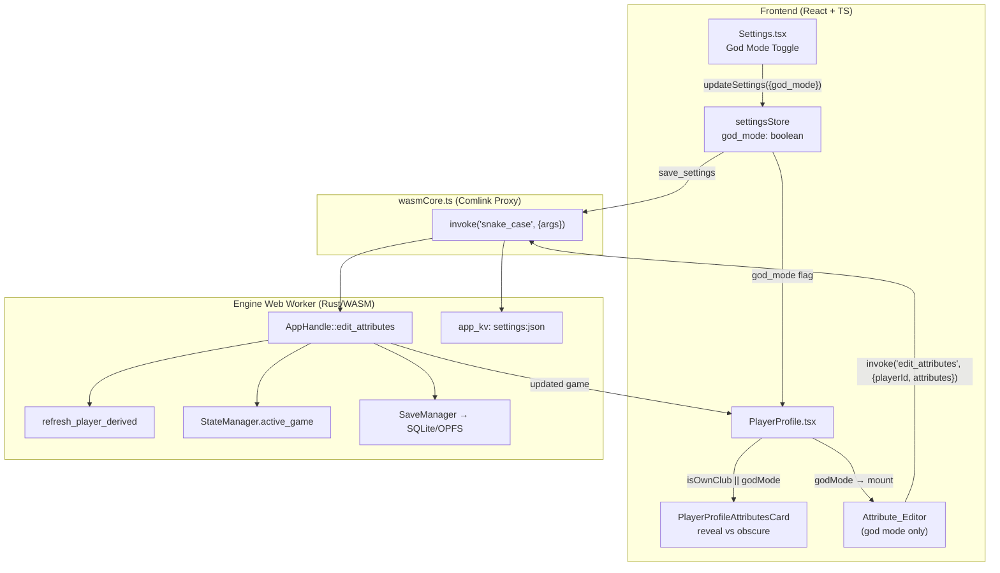

# Design Document

## Overview

God Mode bổ sung một công tắc toàn cục cho phép người chơi (1) xem chỉ số thật của **mọi** cầu thủ, bỏ qua giới hạn hiển thị của Scouting_System, và (2) chỉnh sửa chỉ số cầu thủ với các chỉnh sửa được lưu bền vững vào save.

Thiết kế tách rõ hai mối quan tâm dựa trên kiến trúc hiện có:

- **Hiển thị (reveal)** — Hoàn toàn ở frontend. Dữ liệu chỉ số thật (`player.attributes`, `player.ovr`, `player.potential`) **đã luôn có sẵn** trong `GameStateData` mà engine gửi lên; Scouting_System chỉ là một quyết định *hiển thị* trong `PlayerProfileAttributesCard` (cờ `isOwnClub` quyết định render giá trị thật hay placeholder `??`). Vì vậy God Mode reveal chỉ là việc bỏ qua cổng hiển thị đó — không cần thay đổi engine, không đụng tới dữ liệu trinh sát.
- **Chỉnh sửa (edit)** — Là thay đổi dữ liệu ván chơi nên phải đi qua engine. Một lệnh `#[wasm_bindgen]` mới (`edit_attributes`) nhận id cầu thủ + các giá trị chỉ số yêu cầu, clamp về 0–100, tái tính `ovr`/`potential`/`traits` bằng `refresh_player_derived`, cập nhật `Active_Game` và ghi xuống SQLite.

Công tắc God Mode là một global app setting (`god_mode: bool`) trong `AppSettings`, lưu qua `get_settings`/`save_settings` ở khóa `settings:json` — độc lập với dữ liệu từng save. Ngược lại, các *chỉnh sửa chỉ số* là dữ liệu của save và nằm trong `Game`.

### Tóm tắt nghiên cứu nền tảng (grounding)

Các phát hiện sau từ codebase định hình thiết kế:

1. **Reveal là frontend-only.** `PlayerProfile.tsx` truyền `attrGroups` được build từ `player.attributes` (giá trị thật) vào `PlayerProfileAttributesCard`. Card chỉ dùng `isOwnClub` để chọn nhánh render: nhánh `true` hiển thị `ProgressBar` + số thật, nhánh `false` hiển thị thanh nền với độ rộng `Math.random()` và chữ `??`. Do đó để reveal, chỉ cần đưa thêm cờ `godMode` và mở cổng `isOwnClub || godMode`.
2. **Settings store đã có sẵn rollback.** `useSettingsStore.updateSettings` (`src/store/settingsStore.ts`) đã set optimistic rồi `set({ settings: previousSettings })` khi `save_settings` ném lỗi — thỏa Requirement 1.5 mà không cần code mới (chỉ cần thêm trường `god_mode`).
3. **Mặc định qua merge.** `mergeWithDefaultSettings` đã hợp nhất với `DEFAULT_SETTINGS`; chỉ cần thêm `god_mode: false` vào default (frontend) và `#[serde(default)]` (Rust) để thỏa Requirement 1.4 và 6.4.
4. **Mẫu lệnh engine.** Các lệnh trong `src-engine/src/app_handle/{contracts,squad}.rs` theo khuôn: `snapshot_game()` lấy bản clone → biến đổi → `self.state.set_game(game.clone())` → trả về `game` qua `to_js_value`. Lỗi trả về bằng `to_js("be.error.*")`; deserialize input bằng `serde_wasm_bindgen::from_value` với lỗi `be.error.deserialize:{e}`.
5. **Tái tính chỉ số dẫn xuất.** `refresh_player_derived(player, current_year)` (`ofm_core/player_rating.rs`) tính lại `ovr`, giữ/clamp `potential`, và tính lại `traits`. `current_year` lấy từ `game.clock.current_date.year()` (mẫu `chrono::Datelike` đã dùng trong `squad.rs`).
6. **Persistence.** `SaveManager::save_game(&game, &save_id)` (`db/save_manager.rs`) ghi `Game` vào SQLite của save; `save_id` hiện hành nằm trong `StateManager.active_save_id`. KV settings dùng `kv_get`/`kv_put` khóa `settings:json`.

## Architecture



### Luồng bật/tắt God Mode (Requirement 1)

1. `Settings.tsx` render một `<Toggle checked={settings.god_mode} onChange={(v) => handleUpdate({ god_mode: v })} />` (giống các toggle `high_contrast`, `confirm_advance`).
2. `handleUpdate` gọi `updateSettings({ god_mode: v })` → optimistic set → `save_settings` (qua `invoke`) ghi vào `settings:json`. Nếu lỗi, store khôi phục giá trị cũ.

### Luồng reveal (Requirement 2 & 3)

1. `PlayerProfile` đọc `godMode = useSettingsStore((s) => s.settings.god_mode)`.
2. Truyền `godMode` xuống `PlayerProfileAttributesCard`. Card mở cổng hiển thị bằng `reveal = isOwnClub || godMode`. Vì display là hàm thuần của props, chuyển trạng thái `god_mode` (Req 2.4 / 3.4) tự cập nhật trong cùng chu kỳ render qua re-render của Zustand selector. Không có lệnh engine nào được gọi → dữ liệu trinh sát không đổi (Req 3.3).

### Luồng chỉnh sửa (Requirement 4, 5, 6)

1. Khi `godMode` bật, `PlayerProfile` render `Attribute_Editor` cho mọi chỉ số của cầu thủ đang xem.
2. Submit → `invoke('edit_attributes', { playerId, attributes })`.
3. Engine clamp 0–100 → `refresh_player_derived` → `set_game` → `save_game` → trả về `game`.
4. Frontend gọi `onGameUpdate(game)` để đồng bộ store.

## Components and Interfaces

### Frontend

**`src/store/settingsStore.ts`**
- Thêm `god_mode: boolean` vào interface `AppSettings`.
- Thêm `god_mode: false` vào `DEFAULT_SETTINGS`. `mergeWithDefaultSettings` đã tự áp default cho trường thiếu, nên save cũ (không có `god_mode`) sẽ nhận `false` (Req 1.4, 6.4).
- `updateSettings` không đổi: cơ chế rollback hiện có thỏa Req 1.5.

**`src/pages/Settings.tsx`**
- Thêm một `SettingRow` + `Toggle` bound vào `settings.god_mode` (Req 1.1–1.3). Đặt trong một section phù hợp (ví dụ "Gameplay" hoặc một section "Advanced/God Mode").

**`src/components/playerProfile/PlayerProfile.tsx`**
- Đọc `godMode` từ `useSettingsStore`.
- Truyền `godMode` vào `PlayerProfileAttributesCard` và (khi bật) mount `Attribute_Editor`.
- Cung cấp handler `handleEditAttributes(values)` gọi `invoke('edit_attributes', ...)`, rồi `onGameUpdate(result.game)`.

**`src/components/playerProfile/PlayerProfileAttributesCard.tsx`**
- Thêm prop `godMode?: boolean`. Thay `isOwnClub ?` bằng `reveal = isOwnClub || godMode`. Khi `reveal` true → render giá trị thật; ngược lại giữ nguyên placeholder hiện tại (Req 2.2, 3.2).

**`src/components/playerProfile/PlayerProfileAttributeEditor.tsx`** (mới)
- Nhận `player`, `attrGroups`, và callback `onSubmit(attributes)`.
- Render một input số (0–100) cho mỗi `Player_Attribute` (Req 4.1). Ẩn hoàn toàn khi `godMode` tắt (Req 5.1) — component chỉ được mount khi `godMode` bật.
- Khi submit, gom các giá trị thành object `{ pace, stamina, ... }` và gọi `onSubmit`.

**`src/services/attributeService.ts`** (mới, tùy chọn — theo mẫu `contractService.ts`)
- `editPlayerAttributes(playerId, attributes)` bọc `invoke<{ game: GameStateData }>('edit_attributes', { playerId, attributes })`.

### Backend (engine)

**`src-engine/src/app_handle/settings.rs`**
- Thêm `#[serde(default)] pub god_mode: bool` vào struct `AppSettings`, và `god_mode: false` trong `impl Default`. (Đảm bảo Req 6.4 cho settings — save cũ thiếu trường vẫn parse.)

**`src-engine/src/app_handle/god_mode.rs`** (module lệnh mới, đăng ký trong `mod.rs`)
- Lệnh `#[wasm_bindgen(js_name = editAttributes)] pub fn edit_attributes(&self, player_id: String, attributes: JsValue) -> Result<JsValue, JsValue>`.
- Các bước:
  1. Deserialize `attributes: JsValue` → `AttributeEdits` (Req 5.4; lỗi → `be.error.deserialize:{e}`).
  2. `let mut game = self.snapshot_game()?;` (Req 5.3; không có game → `be.error.noActiveGameSession`).
  3. Tìm cầu thủ theo `player_id`; không thấy → `be.error.playerNotFound`, trả về sớm, **không** `set_game` (Req 5.2 — `game` chỉ là bản clone nên `Active_Game` không đổi).
  4. Áp `AttributeEdits` lên `player.attributes`, mỗi giá trị `clamp(0, 100)` (Req 4.3).
  5. `let year = game.clock.current_date.year();` rồi `refresh_player_derived(player, year)` (Req 4.4).
  6. `self.state.set_game(game.clone())` (Req 4.5).
  7. Persist: lấy `save_id` từ `self.state.get_save_id()`, gọi `save_manager.save_game(&game, &save_id)` (Req 6.1).
  8. Trả về `{ "game": game }` (Req 4.6).

Lệnh sẽ xuất hiện trong `engineCommands.generated.ts` sau `npm run build:engine`, ánh xạ `edit_attributes` → `editAttributes` với thứ tự args `["playerId", "attributes"]`.

## Data Models

### `AttributeEdits` (input deserialization, Rust)

Để vừa nhận giá trị JS dạng số vừa cho phép clamp các giá trị ngoài khoảng, các trường được nhận kiểu rộng (`i64`) và là tùy chọn (cho phép chỉnh một phần). Giá trị không phải số sẽ làm `from_value` thất bại → lỗi deserialize (Req 5.4).

```rust
#[derive(serde::Deserialize)]
struct AttributeEdits {
    pace: Option<i64>, stamina: Option<i64>, strength: Option<i64>, agility: Option<i64>,
    passing: Option<i64>, shooting: Option<i64>, tackling: Option<i64>, dribbling: Option<i64>,
    defending: Option<i64>, positioning: Option<i64>, vision: Option<i64>, decisions: Option<i64>,
    composure: Option<i64>, aggression: Option<i64>, teamwork: Option<i64>, leadership: Option<i64>,
    handling: Option<i64>, reflexes: Option<i64>, aerial: Option<i64>,
}

fn clamp_attr(v: i64) -> u8 { v.clamp(0, 100) as u8 }
```

Áp dụng: với mỗi `Some(v)`, gán `player.attributes.<field> = clamp_attr(v)`; `None` giữ nguyên.

### `AppSettings` (sửa đổi)

Frontend (`src/store/settingsStore.ts`):
```ts
export interface AppSettings {
  // ...trường hiện có...
  god_mode: boolean; // mặc định false
}
```

Rust (`src-engine/src/app_handle/settings.rs`):
```rust
pub struct AppSettings {
    // ...trường hiện có...
    #[serde(default)]
    pub god_mode: bool,
}
```

### `PlayerAttributes` (hiện có, không đổi cấu trúc)

19 chỉ số gốc `u8` 0–100 trong `domain::player::PlayerAttributes`. Edit chỉ ghi đè các trường này; không thêm trường mới vào `Player`/`Game`, nên save cũ vẫn tương thích (Req 6.4) và `Derived_Rating` (`ovr`/`potential`/`traits`) được tái tính nhất quán khi load.

### Phản hồi lệnh `edit_attributes`

```json
{ "game": GameStateData }
```
`GameStateData` chứa `players[]` với cầu thủ đã cập nhật `attributes`, `ovr`, `potential`, `traits`.

## Correctness Properties

*A property is a characteristic or behavior that should hold true across all valid executions of a system — essentially, a formal statement about what the system should do. Properties serve as the bridge between human-readable specifications and machine-verifiable correctness guarantees.*

Các thuộc tính dưới đây được rút ra từ phần prework. Các tiêu chí mang tính hiện diện UI hoặc trạng thái đơn lẻ (1.1, 4.1, 4.2, 5.1, 5.3) được kiểm thử bằng unit/example test thay vì property test (xem Testing Strategy).

### Property 1: Edit clamps every attribute into 0..100

*For any* player in the Active_Game and *any* requested integer attribute values (including negatives and values above 100), after `edit_attributes` succeeds, every stored attribute of that player is within the inclusive range 0..100 and equals `clamp(requested, 0, 100)` for each edited field (unedited fields are unchanged).

**Validates: Requirements 4.3**

### Property 2: Edit recomputes derived ratings from clamped attributes

*For any* player in the Active_Game and *any* requested edits, after `edit_attributes` succeeds, the player's `ovr`, `potential`, and `traits` equal the result of applying `refresh_player_derived` to a player holding the clamped edited attributes (i.e. derived ratings are consistent with the stored attributes, with `potential` preserved/clamped per its rule).

**Validates: Requirements 4.4**

### Property 3: Successful edit is reflected in and returned with the Active_Game

*For any* player in the Active_Game and *any* requested edits, after `edit_attributes` succeeds, the returned game and a subsequent read of the Active_Game both contain the clamped edited attribute values for that player.

**Validates: Requirements 4.5, 4.6**

### Property 4: Edits survive a save/reload round-trip

*For any* player in the Active_Game and *any* requested edits, after `edit_attributes` succeeds and the save is reloaded, the loaded player's attributes equal the clamped edited values and the loaded `Derived_Rating` values are consistent with those attributes.

**Validates: Requirements 6.1, 6.2, 6.3**

### Property 5: Unknown player id errors and leaves the Active_Game unchanged

*For any* Active_Game and *any* player identifier that does not match any player in that game, invoking `edit_attributes` returns a descriptive error and the Active_Game is left unchanged.

**Validates: Requirements 5.2**

### Property 6: Non-deserializable input errors and leaves the Active_Game unchanged

*For any* attribute payload containing a non-numeric or otherwise undeserializable value, invoking `edit_attributes` returns a deserialization error and the Active_Game is left unchanged.

**Validates: Requirements 5.4**

### Property 7: Reveal gating is a pure function of god mode and ownership

*For any* player and *any* ownership state (`isOwnClub`), the attribute display reveals true attribute values (including `ovr` and `potential`) exactly when `god_mode` is true OR `isOwnClub` is true, and obscures them otherwise; toggling `god_mode` changes only the displayed values and never mutates the underlying player or Scouting_System data.

**Validates: Requirements 2.1, 2.2, 2.3, 2.4, 3.1, 3.2, 3.3, 3.4**

### Property 8: Settings missing god_mode default to false

*For any* loaded settings object that omits `god_mode` (including legacy saves with no God_Mode-related fields), merging with defaults yields `god_mode === false` and the load succeeds without error.

**Validates: Requirements 1.4, 6.4**

### Property 9: Failed persistence rolls back the in-memory flag

*For any* prior `AppSettings` state, if persisting an updated settings object fails, the in-memory settings are restored to their prior value (the previous `god_mode` value is preserved).

**Validates: Requirements 1.5**

### Property 10: Toggling persists the requested flag value

*For any* prior `AppSettings` state and *any* boolean value `v`, calling `updateSettings({ god_mode: v })` results in the in-memory and persisted settings having `god_mode === v` (with `save_settings` invoked).

**Validates: Requirements 1.2, 1.3**

## Error Handling

Lệnh `edit_attributes` theo đúng mẫu lỗi của các lệnh hiện có (`to_js("be.error.*")`, được frontend dịch qua `resolveTranslatedErrorMessage`):

| Tình huống | Phát hiện | Mã lỗi trả về | Trạng thái |
|---|---|---|---|
| Không có ván chơi (Req 5.3) | `snapshot_game()` trả `None` | `be.error.noActiveGameSession` | Không đổi (chưa clone/biến đổi gì) |
| Id cầu thủ không tồn tại (Req 5.2) | Không tìm thấy trong `game.players` | `be.error.playerNotFound` | Không đổi (`set_game` chưa được gọi; chỉ thao tác trên bản clone) |
| Payload không hợp lệ (Req 5.4) | `serde_wasm_bindgen::from_value` thất bại | `be.error.deserialize:{e}` | Không đổi (trả lỗi trước khi `snapshot_game`) |
| Khóa SaveManager không khả dụng | `lock()` thất bại | `be.error.saveManagerUnavailable` | `Active_Game` đã cập nhật trong RAM; persistence thất bại được bề mặt hóa cho UI |
| Persist settings thất bại (Req 1.5) | `save_settings` reject | Lỗi được nuốt + rollback | Store khôi phục settings cũ |

Nguyên tắc "không đổi khi lỗi" được đảm bảo về mặt cấu trúc: engine luôn biến đổi trên **bản clone** từ `snapshot_game()` và chỉ gọi `self.state.set_game(...)` sau khi mọi bước validate/clamp/recompute đã thành công. Vì vậy bất kỳ early-return lỗi nào trước `set_game` đều để `Active_Game` nguyên vẹn (nền tảng cho Property 5 và 6).

Thứ tự thực thi bắt buộc trong `edit_attributes`: (1) deserialize input → (2) `snapshot_game` → (3) tìm cầu thủ → (4) clamp & apply → (5) `refresh_player_derived` → (6) `set_game` → (7) `save_game`. Validate id và deserialize phải xảy ra trước `set_game`.

## Testing Strategy

### Phương pháp kép

- **Unit/example tests** — kiểm tra hiện diện UI, wiring, và các trạng thái đơn lẻ.
- **Property-based tests** — kiểm tra các thuộc tính phổ quát trên nhiều input sinh ngẫu nhiên.

PBT phù hợp với tính năng này vì phần lõi (clamp, tái tính derived rating, round-trip lưu/đọc, điều kiện lỗi) là logic thuần có không gian input lớn và đa dạng. Reveal gating cũng là một hàm thuần. Phần render UI thuần túy (sự hiện diện của toggle/input) dùng example test.

### Thư viện và cấu hình PBT

- **Frontend (TypeScript/Vitest)**: dùng **`fast-check`** (thêm vào `devDependencies`) tích hợp với Vitest hiện có (`vitest run`). Không tự viết PBT từ đầu.
- **Backend (Rust)**: dùng **`proptest`** (thêm vào `[dev-dependencies]` của crate `engine` và/hoặc `ofm_core`). Không tự viết PBT từ đầu.
- Mỗi property test chạy **tối thiểu 100 vòng** (`fast-check`: `{ numRuns: 100 }`; `proptest`: `ProptestConfig { cases: 100, .. }`).
- Mỗi property test gắn comment tham chiếu tới property trong design, định dạng:
  `Feature: god-mode, Property {number}: {property_text}`

### Phân bổ property → vị trí test

| Property | Lớp | Công cụ | Ghi chú |
|---|---|---|---|
| P1 Clamp | engine (`edit_attributes`/helper) | proptest | Sinh `i64` gồm âm và >100; kiểm mọi field stored ∈ [0,100]. |
| P2 Derived recompute | engine | proptest | So với player tham chiếu qua `refresh_player_derived`. |
| P3 Active-game reflects edits | engine | proptest | Edit → `get_active_game` chứa giá trị clamp. |
| P4 Persistence round-trip | engine + db (`SaveManager`, `tempfile`) | proptest | Edit → `save_game` → `load_game`; so attributes & derived. |
| P5 Unknown id unchanged | engine | proptest | Sinh id không khớp; so `Game` trước/sau (qua serialize) bằng nhau + lỗi. |
| P6 Bad input unchanged | engine | proptest | Sinh payload có trường phi số; so `Game` không đổi + lỗi. |
| P7 Reveal gating | frontend (`PlayerProfileAttributesCard`) | fast-check + Testing Library | Sinh player + `isOwnClub` + `godMode`; kiểm reveal ⇔ (godMode‖isOwnClub) và dữ liệu input không bị mutate. |
| P8 Settings default | frontend (`mergeWithDefaultSettings`) | fast-check | Sinh partial settings bỏ `god_mode`; kết quả `false`. |
| P9 Persist-failure rollback | frontend (`settingsStore`) | fast-check | Sinh prior settings; `save_settings` reject ⇒ khôi phục. |
| P10 Toggle persistence | frontend (`settingsStore`) | fast-check | Sinh prior settings + boolean; sau update có `god_mode===v`. |

### Example / edge-case unit tests (không phải PBT)

- **1.1** — Settings render toggle phản ánh `god_mode` (true/false).
- **4.1** — Editor render một input cho mỗi chỉ số của cầu thủ (gồm nhóm Goalkeeper khi áp dụng).
- **4.2** — Submit gọi `invoke('edit_attributes', { playerId, attributes })` với đúng giá trị (mock `invoke`).
- **5.1** — `godMode=false` ⇒ không mount Attribute_Editor.
- **5.3** — Không có Active_Game ⇒ `edit_attributes` trả `be.error.noActiveGameSession` (single-execution test).
- **Edge cases trong generator PBT**: giá trị biên 0, 100, âm, >100; cầu thủ thủ môn (nhóm GK), cầu thủ tự do (`team_id = None`); chỉnh một phần (chỉ một số trường) so với chỉnh toàn bộ.

### Lưu ý cân bằng

Ưu tiên property test cho phần phủ input rộng; giữ unit test tập trung vào hiện diện UI, wiring tương tác, và trạng thái lỗi đơn lẻ — tránh viết quá nhiều unit test trùng với phạm vi đã được property test phủ.
