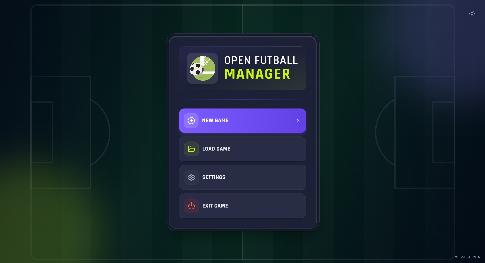
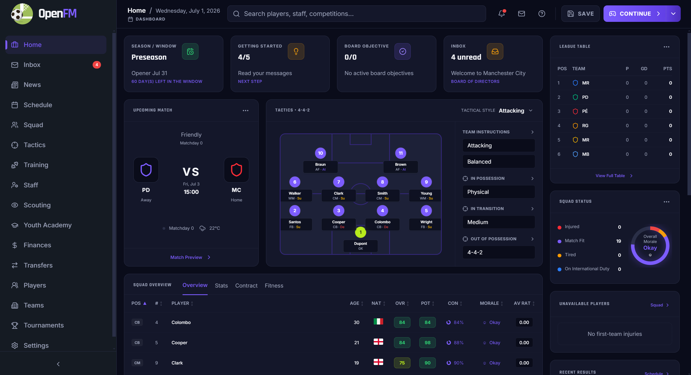
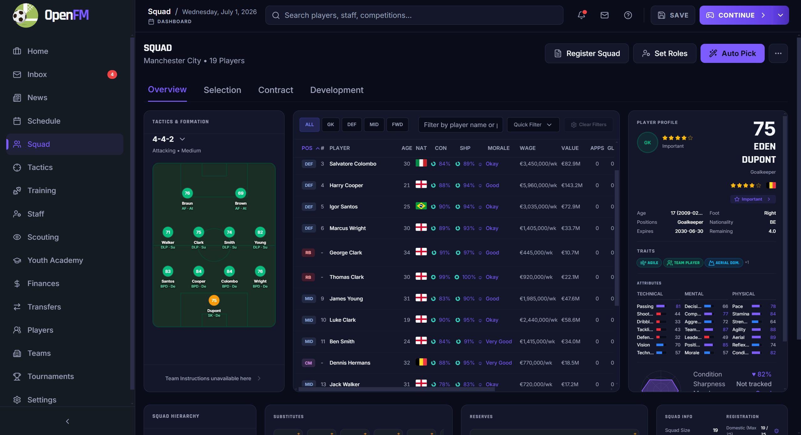
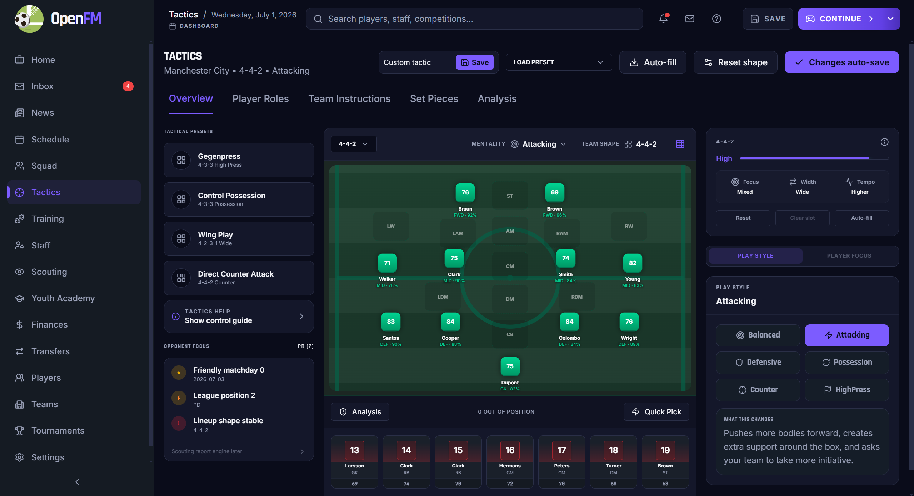
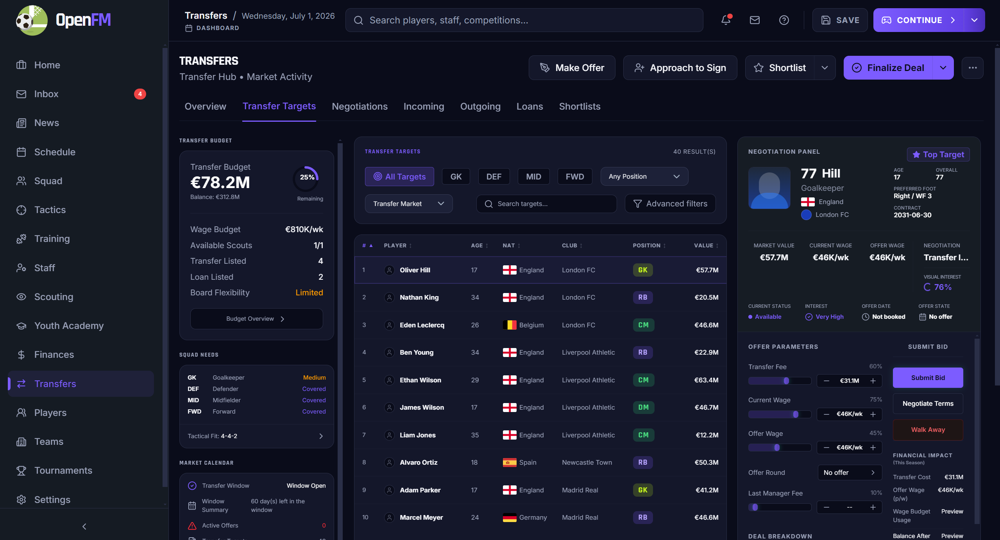
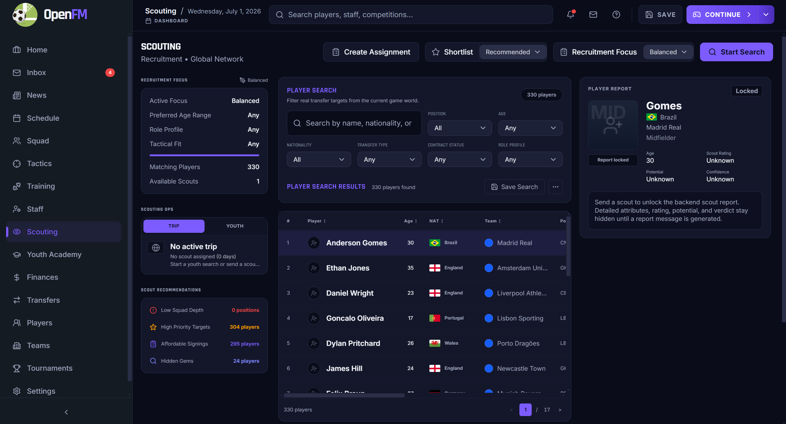
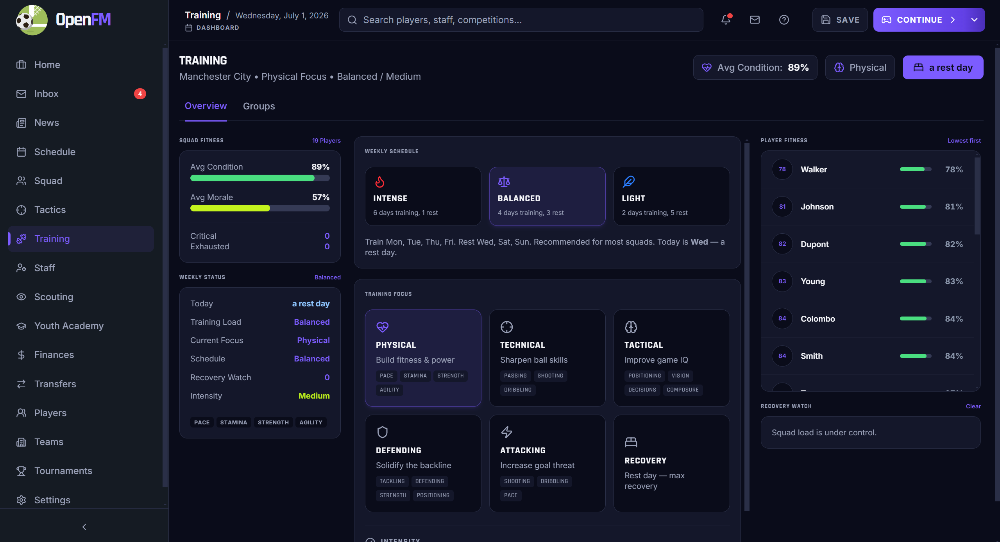
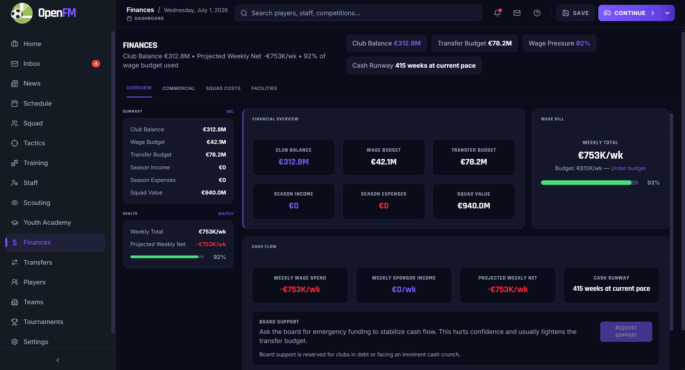

# OpenFoot Manager

**OpenFoot Manager** is an open-source football management web game focused on long-term club building, match-day decisions, squad development, transfers, finances, staff, scouting, and immersive football-world storytelling.

Built with **React**, **TypeScript**, **Vite**, and a **Rust simulation engine compiled to WebAssembly**, OpenFoot Manager aims to deliver the feel of a modern Football Manager-style experience in an accessible web-first architecture.

> Status: active development. Expect rapid iteration, incomplete balance, and evolving game systems.

---

## Showcase

> Add screenshots to `docs/showcase/` using the filenames below, then the images will render automatically in this README.

| Main Menu | Dashboard Home |
| --- | --- |
|  |  |

| Squad & Player Management | Tactics |
| --- | --- |
|  |  |

| Transfers | Scouting |
| --- | --- |
|  |  |

| Training | Finances |
| --- | --- |
|  |  |

---

## Features

### Club management

- Manage squads, player contracts, morale, injuries, form, and development.
- Build tactical identities through formations, roles, play styles, and tactical presets.
- Run weekly training plans with focus, intensity, recovery, and player readiness feedback.
- Hire and manage staff roles that affect coaching, scouting, and medical outcomes.

### Football world simulation

- Generate a playable football world with teams, players, staff, schedules, news, and inbox messages.
- Advance time through daily and weekly simulation loops.
- Follow league standings, fixtures, tournament progress, and club performance over time.

### Match day

- Play through live matches with tactical decisions, match events, condition changes, and post-match flow.
- Support different match approaches such as live control, spectator-style viewing, or delegation.
- Simulate outcomes through a Rust-powered football engine.

### Transfers and scouting

- Search players and teams across the football world.
- Scout players, manage shortlists, and evaluate reports.
- Negotiate transfers, loans, and squad-building moves.
- Use youth recruitment and academy workflows to develop future prospects.

### Finance and board management

- Track club balance, wage pressure, sponsorship income, cash runway, and payroll.
- Upgrade club facilities when finances allow.
- Handle sponsorship offers, marketing campaigns, and board support requests.

### Settings and accessibility

- Change language, currency, theme, UI scale, match defaults, and display preferences.
- Supports app-wide settings persistence through the frontend settings store and backend IPC.

---

## Tech Stack

| Layer | Technology |
| --- | --- |
| Frontend | React 19, TypeScript, Vite |
| Styling | Tailwind CSS v4, app design tokens |
| State | Zustand |
| Charts/UI | Recharts, Lucide icons, custom UI components |
| Engine | Rust workspace compiled to WebAssembly |
| IPC / Commands | Generated engine command bridge |
| Testing | Vitest, React Testing Library, jsdom |

---

## Project Structure

```text
openfootmanager/
├── src/                    # React app, dashboard pages, UI components, stores
├── src-engine/             # Rust engine/workspace and generated command bridge
│   ├── crates/domain/      # Shared domain models
│   ├── crates/engine/      # Football simulation engine
│   ├── crates/ofm_core/    # Game orchestration logic
│   ├── crates/db/          # Persistence layer
│   └── crates/engine_wasm/ # WASM-facing engine package
├── scripts/                # Build/codegen scripts
├── docs/                   # Technical and gameplay documentation
└── public/                 # Static assets
```

---

## Getting Started

### Prerequisites

- Node.js 20+
- npm
- Rust stable toolchain
- `wasm-pack` for building the Rust engine WebAssembly package

Install `wasm-pack` if needed:

```bash
cargo install wasm-pack
```

### Install dependencies

```bash
npm install
```

### Build the engine command bridge

```bash
npm run build:engine
```

### Start the development server

```bash
npm run dev
```

Open the local Vite URL shown in your terminal.

---

## Scripts

| Command | Description |
| --- | --- |
| `npm run dev` | Start the Vite dev server |
| `npm run build:engine` | Build the Rust/WASM engine and generate engine commands |
| `npm run build` | Build engine, typecheck, and create production frontend build |
| `npm run preview` | Preview the production build |
| `npm run test` | Run the Vitest test suite |
| `npm run test:watch` | Run Vitest in watch mode |
| `npm run audit:i18n` | Audit translation key usage |

---

## Testing

Run the full test suite:

```bash
npm run test
```

Run TypeScript checks:

```bash
npx tsc --noEmit
```

Run targeted dashboard regression tests:

```bash
npx vitest run src/pages/Dashboard.test.tsx --reporter=verbose
```

---

## Documentation

Technical and gameplay docs live in [`docs/`](docs/README.md):

- [`docs/GETTING_STARTED.md`](docs/GETTING_STARTED.md) — player-facing gameplay guide.
- [`docs/ARCHITECTURE.md`](docs/ARCHITECTURE.md) — app architecture, data flow, and command interface.
- [`docs/MATCH_SIMULATION.md`](docs/MATCH_SIMULATION.md) — match engine details.
- [`docs/GAME_SYSTEMS.md`](docs/GAME_SYSTEMS.md) — training, staff, finance, news, world generation, and more.
- [`docs/DEFINITIONS.md`](docs/DEFINITIONS.md) — world definition file formats.

---

## Roadmap Ideas

OpenFoot Manager is still evolving. Areas that are natural candidates for future work:

- deeper AI squad-building logic
- richer player personality and media systems
- expanded transfer negotiation depth
- more competitions and continental football structures
- long-term youth development and academy pipelines
- richer club history, records, and analytics
- improved save compatibility and modding tools

---

## Contributing

Contributions are welcome. Good first contributions include:

- bug fixes
- UI polish
- gameplay balancing
- translations
- documentation improvements
- tests for existing systems

Before submitting a larger gameplay or architecture change, consider opening an issue or draft proposal so the approach can be discussed.

### Development expectations

- Preserve existing game logic unless the change explicitly targets gameplay behavior.
- Add or update tests for behavior changes.
- Keep UI changes consistent with the dashboard design language.
- Avoid committing generated or local-only files unless they are required by the build.

---

## License

No license file is currently included. Add a `LICENSE` file before distributing or accepting broad external contributions.

---

## Acknowledgements

OpenFoot Manager is inspired by the long tradition of football management games and by open-source simulation projects that make deep sports-management systems easier to study, modify, and extend.
